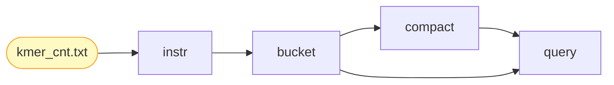

# KERO Tools

## Introduction

**KERO** (**K**-mer **E**ngine with **R**ead-**O**ptimized indexing) is a lightweight, read-optimized columnar storage engine for efficient k-mer count storage and querying.

### What Does KERO Do?

In genomic analysis, k-mers (DNA sequences of length k) are fundamental building blocks for tasks like genome assembly, variant detection, and sequence comparison. The typical workflow involves two steps:

1. **K-mer Counting** (preprocessing): Use specialized tools such as [KMC](https://github.com/refresh-bio/KMC), [Jellyfish](https://github.com/gmarcais/Jellyfish), or [DSK](https://github.com/GATB/dsk) to extract all k-mers from raw sequencing data and count their occurrences. These tools output k-mer count tables (text files mapping each k-mer to its frequency).

2. **K-mer Indexing and Querying** (KERO's role): KERO takes these k-mer count tables and builds a compact, queryable index. Once indexed, you can perform high-speed lookups to:
    - **Find the count of a given k-mer**: Query whether a specific k-mer exists and retrieve its abundance
    - **Batch query sequences**: Extract counts for all k-mers in a long sequence or read
    - **Interactive exploration**: Rapidly analyze k-mer distributions without loading entire datasets into memory

KERO transforms static k-mer count archives into high-performance queryable databases, enabling fast, interactive analysis of large-scale k-mer datasets that are otherwise difficult to query efficiently.

### Core Innovations

1. **MPHF-Based Indexing**: Direct O(1) block-level access using Minimal Perfect Hash Functions (PTHash)
2. **Columnar Storage with Integer Array Compression**: SIMD-accelerated compression (TurboPFor) on column-oriented layout
3. **Lock-Free Parallel Query Framework**: Memory-mapped I/O with batch processing for maximum throughput

### Performance Highlights

Compared to Jellyfish, BCALM, KMC, USTAR, SSHash, and KFF, KERO achieves:
- **Up to 10.9× smaller file size** through super-k-mer compression and columnar storage
- **Up to 1611.1× faster query speed** via MPHF-based indexing and parallel processing
- **Up to 554.0× lower memory usage during queries** using memory-mapped I/O

For detailed experimental results and comprehensive performance comparison, please refer to our paper (under review).

### Datasets

We evaluated KERO on eight publicly available NCBI datasets, including six genome assemblies and two metagenomic samples, covering diverse species, sample types, and sizes ranging from 0.55 GB to 3.20 GB. Two metagenomes were included to assess KERO's performance on data with high k-mer redundancy and complexity typical of mixed microbial communities.

| Abbreviation | Description | NCBI Accession | Size (GB) |
|:-------------|:------------|:---------------|----------:|
| **Genome** ||||
| *H.h* | *Helleia helle* (violet copper) | [GCA_963853865.1](https://www.ncbi.nlm.nih.gov/datasets/genome/GCA_963853865.1/) | 0.55 |
| *S.l* | *Solanum lycopersicum* (tomato) | [GCF_036512215.1](https://www.ncbi.nlm.nih.gov/datasets/genome/GCF_036512215.1/) | 0.81 |
| *G.g* | *Gallus gallus* (chicken) | [GCF_016699485.2](https://www.ncbi.nlm.nih.gov/datasets/genome/GCF_016699485.2/) | 1.02 |
| *P.s* | *Polyodon spathula* (Mississippi paddlefish) | [GCF_017654505.1](https://www.ncbi.nlm.nih.gov/datasets/genome/GCF_017654505.1/) | 1.50 |
| *C.m* | *Chelonia mydas* (green sea turtle) | [GCF_015237465.2](https://www.ncbi.nlm.nih.gov/datasets/genome/GCF_015237465.2/) | 2.10 |
| *H.s* | *Homo sapiens* (human) | [GCF_000001405.40](https://www.ncbi.nlm.nih.gov/datasets/genome/GCF_000001405.40/) | 3.20 |
| **Metagenome** ||||
| *Y.s* | Hot spring sample from Yellowstone | [SRR5650742](https://www.ncbi.nlm.nih.gov/sra/SRR5650742) | 0.80 |
| *H.f* | Viral-like particles from human faeces | [SRR6128039](https://www.ncbi.nlm.nih.gov/sra/SRR6128039) | 1.71 |

### Available Commands

The `kero-tools` executable provides a complete workflow for k-mer analysis:

- **`instr`**: Convert text k-mer count files (from Jellyfish, KMC, etc.) into KERO format
- **`bucket`**: Partition k-mers into minimizer-based sections for indexing
- **`compact`**: Merge overlapping k-mers into super-k-mers using greedy assembly
- **`query`**: Perform high-speed k-mer lookups with count retrieval
- **`validate`**: Verify file integrity and report structural statistics
- **`outstr`**: Export k-mers back to text format

## Install

### Prerequisites

- C++ compiler with C++17 support (GCC 7+, Clang 5+, or MSVC 2017+)
- CMake version 3.19 or newer
- Git

### Platform Compatibility

KERO Tools has been tested and is fully functional on:
- **Ubuntu 22.04 LTS** (Linux)
- **macOS Sequoia 15.3** (Darwin)

### Build Instructions

#### Standard Build (Release Mode)

1. Clone the repository with submodules:

```bash
git clone --recursive https://github.com/RC-Kanashii/kero-tools.git
cd kero-tools
```

2. Create a build directory and compile:

```bash
mkdir build && cd build
cmake ..
make -j
```

3. The `kero-tools` executable will be located in `kero-tools/bin/Release/`.

#### Debug Build

For development and debugging purposes, you can build in Debug mode:

```bash
mkdir build_debug && cd build_debug
cmake -DCMAKE_BUILD_TYPE=Debug ..
make -j
```

The debug executable will be located in `kero-tools/bin/Debug/kero-tools`.

#### Adding to PATH

You can add the executable to your PATH for convenient access:

```bash
# For Release build
export PATH=$PATH:/path/to/kero-tools/bin/Release

# For Debug build
export PATH=$PATH:/path/to/kero-tools/bin/Debug
```

## Quick Start

### Prerequisites

Before using KERO Tools, you need a k-mer counting tool installed. Here are two popular tools:
- **KMC** (recommended): https://github.com/refresh-bio/KMC
- **Jellyfish**: https://github.com/gmarcais/Jellyfish

### Workflow

The following diagram illustrates the typical KERO workflow. After `bucket`, you can either proceed directly to `query` or first use `compact` for smaller file size. The `validate` command can be used at any stage to verify file integrity.



### Complete Example

Here's a complete example using the provided SARS-CoV-2 genome (`example/sars.fasta`):

**Step 0: Generate k-mer counts using a k-mer counter**

```bash
cd example
```

Option A: Using KMC (outputs tab-delimited format)
```bash
kmc -k15 -ci0 -fm sars.fasta sars_k15 .
kmc_tools transform sars_k15 dump sars_k15_cnt.txt
```

Option B: Using Jellyfish (outputs space-delimited format)
```bash
jellyfish count -m 15 -s 100M -t 4 -C sars.fasta -o sars_k15.jf
jellyfish dump sars_k15.jf > sars_k15_cnt.txt
```

**K-mer count file format:**

The generated `sars_k15_cnt.txt` file contains one k-mer per line with its count, separated by a delimiter:

```
AAAAAAGAAACATCA	1
AAAAACAACAAAAGT	1
AAAAACAGCAAGAAG	1
AAAAACTAATATAAT	1
...
```

- **KMC output**: k-mer and count separated by **tab** (`\t`)
- **Jellyfish output**: k-mer and count separated by **space**

**Step 1: Convert k-mer counts to KERO format**

Note: KMC outputs k-mer counts using tab (`\t`) as the delimiter between k-mer and count, while Jellyfish uses space. Since KERO Tools defaults to space delimiter, you must explicitly specify `--delimiter $'\t'` when using KMC output.

For KMC output:
```bash
kero-tools instr -i sars_k15_cnt.txt -o sars_k15.kero -k 15 -d 1 --delimiter $'\t'
```

For Jellyfish output:
```bash
kero-tools instr -i sars_k15_cnt.txt -o sars_k15.kero -k 15 -d 1
```

**Step 2: Organize k-mers by minimizers (bucketing)**

Groups k-mers sharing the same minimizer into sections:
```bash
kero-tools bucket -i sars_k15.kero -o sars_k15_m10.kero -m 10
```

**Step 3: Compact overlapping k-mers into super-k-mers**

Merges consecutive k-mers to reduce file size:
```bash
kero-tools compact -i sars_k15_m10.kero -o sars_k15_m10_c.kero
```

**Step 4 (Optional): Validate the database**

Checks structural integrity and reports database statistics:
```bash
kero-tools validate -i sars_k15_m10.kero -o sars_k15_m10_validation.txt -v
kero-tools validate -i sars_k15_m10_c.kero -o sars_k15_m10_c_validation.txt -v
```

**Step 5: Query k-mers from the database**

Query a single k-mer or sequence:
```bash
kero-tools query -i sars_k15_m10_c.kero -s AACCAGTTAACTGGT -o result.txt
```

Query multiple k-mers from a file (create `queries.txt` with sequences, one per line):
```bash
kero-tools query -i sars_k15_m10_c.kero -S queries.txt -o results.txt
```

**Output format** (`result.txt`):
```
AACCAGTTAACTGGT 2
```

**Important notes**:
- KMC outputs use tab delimiter, while Jellyfish uses space (KERO's default). Always specify `--delimiter $'\t'` for KMC.
- Both bucket and compact databases support queries; compact databases are smaller.
- Choose `-d` (data size) based on max count: `-d 1` (≤255), `-d 2` (≤65535), `-d 4` (≤4B).
- Use `-S` for file input or `-s` for a single sequence query.

## Commands

### `kero-tools instr`

Convert text files containing k-mers into the KERO format. Each line must contain exactly one k-mer of the specified length.

**Parameters:**

- `-i, --infile <input.txt>` [required]: Input text file with k-mers (one per line)
- `-o, --outfile <output.kero>` [required]: Output KERO file
- `-k, --kmer-size <int>` [required]: Size of k-mers
- `-d, --data-size <int>`: Size of data associated with each k-mer in bytes (default: 0)
- `-m, --max-kmer-seq <int>`: Maximum k-mers per sequence block; longer sequences will be split (default: 255)
- `--delimiter <char>`: Delimiter between sequence and its data (default: ' ')
- `--data-delimiter <char>`: Delimiter between data values (default: ',')

**Input Format:**

The input file must contain **one k-mer per line**, where each k-mer's length exactly matches the specified `-k` value.

For k-mers with counts (using space delimiter by default):
```
AAAAAAGAAACATCA 1
AAAAACAACAAAAGT 2
AAAAACAGCAAGAAG 5
```

For k-mers with counts (using tab delimiter, typical for KMC output):
```
AAAAAAGAAACATCA	1
AAAAACAACAAAAGT	2
AAAAACAGCAAGAAG	5
```

For k-mers without data:
```
AAAAAAGAAACATCA
AAAAACAACAAAAGT
AAAAACAGCAAGAAG
```

**Example:**

```bash
# Convert KMC k-mer counts (tab-delimited) to KERO format
kero-tools instr -i kmc_counts.txt -o kmers.kero -k 15 -d 1 --delimiter $'\t'

# Convert Jellyfish k-mer counts (space-delimited) to KERO format
kero-tools instr -i jf_counts.txt -o kmers.kero -k 31 -d 1

# Convert k-mers without counts
kero-tools instr -i kmers_only.txt -o kmers.kero -k 21
```

---

### `kero-tools bucket`

Partition k-mers from raw sections into minimizer-based sections. K-mers sharing the same smallest m-mer (minimizer) are grouped into the same section, which is a prerequisite for compaction.

**Parameters:**

- `-i, --infile <input.kero>` [required]: KERO file to bucketize
- `-o, --outfile <output.kero>` [required]: Output file containing minimizer sections
- `-m, --minimizer-size <int>` [required]: Size of the minimizer

**Example:**

```bash
kero-tools bucket -i raw_kmers.kero -o bucketed.kero -m 15
```

**Note:** Choose a minimizer size that balances the number of buckets with bucket size. Common values are m = k/2 to k/3.

---

### `kero-tools compact`

Compact overlapping k-mers within each minimizer section into longer super-k-mers. This significantly reduces file size and is essential for efficient querying.

**Parameters:**

- `-i, --infile <input.kero>` [required]: Bucketed KERO file
- `-o, --outfile <output.kero>` [required]: Output compacted file
- `-s, --sorted`: Sort super-k-mers to allow binary search (may slightly reduce compaction ratio)

**Example:**

```bash
kero-tools compact -i bucketed.kero -o compacted_db.kero

# With sorting for faster queries
kero-tools compact -i bucketed.kero -o compacted_db.kero -s
```

**Note:** Compaction works by finding overlapping k-mers (e.g., ATGC and TGCA overlap with ATGCA) and merging them into super-k-mers.

---

### `kero-tools validate`

Read a KERO file and check for structural integrity and corruption. Exits with an error if problems are found.

**Parameters:**

- `-i, --infile <input.kero>` [required]: File to validate
- `-o, --outfile <output.txt>` [required]: File to write validation report
- `-v, --verbose`: Print detailed information about the file's structure
- `--index-only`: Restrict validation to index sections only

**Example:**

```bash
# Basic validation
kero-tools validate -i my_file.kero -o validation_report.txt

# Verbose validation with detailed output
kero-tools validate -i my_file.kero -o validation_report.txt -v

# Validate only the index
kero-tools validate -i my_file.kero -o validation_report.txt --index-only
```

---

### `kero-tools query`

Query a KERO file to find counts or associated data for one or more k-mers. Requires an indexed KERO file created with `bucket` and `compact` commands.

**Parameters:**

- `-i, --infile <input.kero>` [required]: Indexed KERO file to query
- `-o, --output <output.txt>`: File to write query results (default: stdout)
- `-s, --kmer <string>`: Single k-mer or longer sequence from which to query all k-mers
- `-S, --kmer-file <filename>`: File containing k-mers or sequences to query (one per line)
- `--kmer-per-line`: Flag indicating that `--kmer-file` contains one k-mer per line (not long sequences)
- `--no-index`: Force sequential scan instead of using the index (slower but useful for non-indexed files)

**Example:**

```bash
# Query a single k-mer (output to file)
kero-tools query -i db.kero -s AACCAGTTAACTGGT -o result.txt

# Query and output to stdout
kero-tools query -i db.kero -s AACCAGTTAACTGGT

# Query all k-mers from a file of sequences
kero-tools query -i db.kero -S reads.fasta -o results.txt

# Query specific k-mers (one per line)
kero-tools query -i db.kero -S kmers.txt --kmer-per-line -o results.txt
```

---

### `kero-tools outstr`

Read a KERO file and print k-mer sequences and associated data to a file or standard output as text strings.

**Parameters:**

- `-i, --infile <input.kero>` [required]: KERO file to read
- `-o, --outfile <output.txt>`: Output file for k-mer sequences (default: stdout)
- `-c, --reverse-complement`: Print lexicographically canonical k-mers (choosing between forward and reverse-complement)

**Example:**

```bash
# Output to stdout
kero-tools outstr -i my_kmers.kero

# Output to file
kero-tools outstr -i my_kmers.kero -o my_kmers.txt

# Output canonical k-mers to file
kero-tools outstr -i my_kmers.kero -o canonical_kmers.txt -c
```

---

## Ablation Study: Building Multiple Storage Configurations

KERO Tools supports three different storage modes for ablation experiments and performance comparison:

1. **ROW**: Row-oriented storage without compression
2. **COLUMNAR_NOCOMP**: Columnar storage without integer array compression
3. **COLUMNAR_COMP**: Columnar storage with integer array compression (default)

### Quick Build: All Configurations at Once

For convenience, you can build all three configurations with a single script:

```bash
bash script/build_all_ablation.sh
```

This will create three binaries in the `ablation_binaries/` directory:
- `kero-tools-row`: Row-oriented mode
- `kero-tools-col`: Columnar mode without integer array compression
- `kero-tools-final`: Columnar mode with integer array compression

### Manual Build: Individual Configurations

Alternatively, each configuration can be built manually by specifying the `KERO_STORAGE_MODE` parameter during CMake configuration.

**Build ROW configuration (row-oriented, no compression):**

```bash
rm -rf build_row && mkdir build_row && cd build_row
cmake -DKERO_STORAGE_MODE=ROW ..
make -j
cp bin/Release/kero-tools ../kero-tools-row
cd ..
```

**Build COLUMNAR_NOCOMP configuration (columnar, no integer array compression):**

```bash
rm -rf build_col && mkdir build_col && cd build_col
cmake -DKERO_STORAGE_MODE=COLUMNAR_NOCOMP ..
make -j
cp bin/Release/kero-tools ../kero-tools-col
cd ..
```

**Build COLUMNAR_COMP configuration (columnar with integer array compression):**

```bash
rm -rf build_final && mkdir build_final && cd build_final
cmake -DKERO_STORAGE_MODE=COLUMNAR_COMP ..
make -j
cp bin/Release/kero-tools ../kero-tools-final
cd ..
```

**Note:** You can also use the individual build scripts located in `script/`:
- `bash script/build_ablation_row.sh`
- `bash script/build_ablation_col.sh`
- `bash script/build_ablation_final.sh`

### Usage

Use each binary independently for your ablation experiments:

```bash
# Using the row-oriented version
./kero-tools-row instr -i input.txt -o output.kero -k 31 -d 1

# Using the columnar version without integer array compression
./kero-tools-col bucket -i input.kero -o output.kero -m 15

# Using the columnar version with integer array compression
./kero-tools-final compact -i input.kero -o output.kero
```

This allows you to compare file sizes, construction times, and query performance across different storage strategies.

---

## Citation

If you use KERO Tools in your research, please cite:

```
Y. Chen, M. S. Nawaz, P. Fournier-Viger, T. Dinh, J. Zhang. KERO: An Efficient Engine for Storing and Querying k-mers Counts (under review).
```

## Contact

For questions or contributions, please open an issue or submit a PR on our [GitHub repository](https://github.com/RC-Kanashii/kero-tools).

You can also contact us at: yi.chen.01 [at] outlook [dot] com